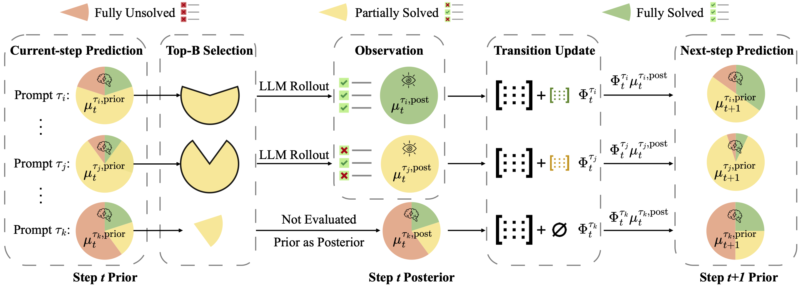

# DPS: Dynamics-Predictive Sampling for Active RL Finetuning of Large Reasoning Models

<div align="center">


</div>

This repository contains code for **Dynamics-Predictive Sampling (DPS)**, a framework that online predicts and selects informative prompts prior to rollout by inferring their learning dynamics, thereby accelerating RL finetuning of large reasoning models.

DPS models each prompt's solving progress in RL finetuning as a dynamical system, treating solving extent as the state with transitions characterized by a hidden Markov model. By employing lightweight inference, it predicts and selects informative (partially solved) prompts online, without requiring rollout-intensive filtering. Empirical results across diverse reasoning tasks demonstrate that DPS reduces redundant rollouts, accelerates training, and achieves superior reasoning performance. 




## 🔧 Installation

First creat and activate a conda environment by running:

```bash
conda create -n dps python=3.10 -y
conda activate dps
```

Ensure you have **CUDA ≥ 12.4**, then run:

```bash
bash prepare.sh
```

This script installs all required packages and dependencies.

## 📦 Dataset Preparation

We support multiple reasoning tasks. Run the following scripts to preprocess each dataset:

```bash
# Mathematics dataset
python recipe/dps/data_preprocess/math_dataset.py --local_dir='./data/math'

# Mathematics Evaluation Benchmarks from deepscaler
python recipe/dps/data_preprocess/deepscaler/deepscaler_dataset.py --local_dir='./data/deepscaler'

# Countdown-34
python recipe/dps/data_preprocess/countdown.py --local_dir='./data/countdown3to4'

# Countdown-4
python recipe/dps/data_preprocess/countdown4.py --local_dir='./data/countdown4'

# Geometry3k
python recipe/dps/data_preprocess/geo3k.py --local_dir='./data/geo3k'
```

## 📥 Download Pretrained Models

You can download models from [Hugging Face](https://huggingface.co/) as follows (example shown with DeepSeek-R1-Distill-Qwen-1.5B):

```bash
huggingface-cli download --resume-download deepseek-ai/DeepSeek-R1-Distill-Qwen-1.5B --local-dir models/DeepSeek-R1-Distill-Qwen-1.5B
```

> Tip: You can change `--local-dir` to your own model path. Be sure to match it with your training configs.

## 🚀 Training

All training scripts are located in:

```
recipe/dps/scripts/
```

These include task-specific scripts for launching DPS and baseline methods with different backbones and datasets.

Before launching experiments, log in to your Weights & Biases account by setting your WANDB_API_KEY:

```bash
export WANDB_API_KEY=YOUR_API_KEY
wandb login --relogin "$WANDB_API_KEY"
```

Below is an example of how to launch DPS training on the MATH task with DeepSeek-R1-Distill-Qwen-1.5B:


```
bash recipe/dps/scripts/math/math_verl_1.5b_dps.sh
```


## 📥 Integration Guide


The main implementation of the DPS sampler is in [`task_sampler.py`](recipe/dps/task_sampler.py), featuring two key operations:

### 1️⃣ `train`: Online Inference and Transition Learning

We perform online Bayesian inference to track the solving states for a given prompt during training.
The procedure follows a three-stage pipeline at each training step $t$: 

(i) update the prior $\mu_t^{\text{prior}}$ to a posterior $\mu_t^{\text{post}}$, using the observation $y_t$ if available, otherwise setting the posterior to the prior; 

(ii) if $y_t$ is observed, refine the transition model;

(iii) propagate the posterior forward through the transition model to generate the next-step prior $\mu_{t+1}^{\text{prior}}$.

> 💡 **Note:** Smaller values of decay ratio $\lambda$ (self.hmm_transition_decay_ratio) yield faster adaptation to evolving dynamics. The transition prior $\alpha_0$ (self.prior_alpha) enables the encoding of domain knowledge about plausible transition structures.

### 2️⃣ `sample_batch`: Prompt Sampling with Predicted Dynamics

Given the predictive solving-state belief $\mu_t^{\tau,\text{prior}} = \mathbb{P}(z_t \mid y_{1:t-1})$ for each prompt $\tau$, we prioritize prompts according to their predicted probability of being partially solved (State $2$), denoted $\mu_t^{\tau,\text{prior}}(2)$. Formally, the $B$ prompts with the highest State $2$ probabilities are selected to constitute the training batch at step $t$:

$$
\mathcal{B}_t = \mathrm{Top}_B\Big(\Big\{\tau \in \mathcal{D} \mid \mu_t^{\tau,\text{prior}}(2) \Big\} \Big).
$$

> 💡 **Note:** DPS naturally supports alternative selection strategies, e.g., entropy regularized selection.

### 🔌 Easy Integration

DPS can be easily integrated into your RL training pipeline.

**Key Integration Points:**
- 📊 **Before rollout**: Call `sample_batch()` to select prompts
- 🔄 **After reward**: Call `train()` to update HMM and generate next-step prior

```python
for epoch in range(self.config.trainer.total_epochs):
    for batch_dict in self.train_dataloader:
        # Step 1: Active pre-rollout prompt selection
        if self.task_sampler is not None:
            batch_dict, sampled_acquisition_score = self.task_sampler.sample_batch(batch_dict)
        
        # ... (rollout generation & evaluation)

        # Step 2: Update HMM with observed reward signals and and generate next-step prior
        self.task_sampler.train(batch_dict, success_rate)
        # ... (RL training)
```


## 📚 Citation

If you find this work useful for your research, please cite our paper :)